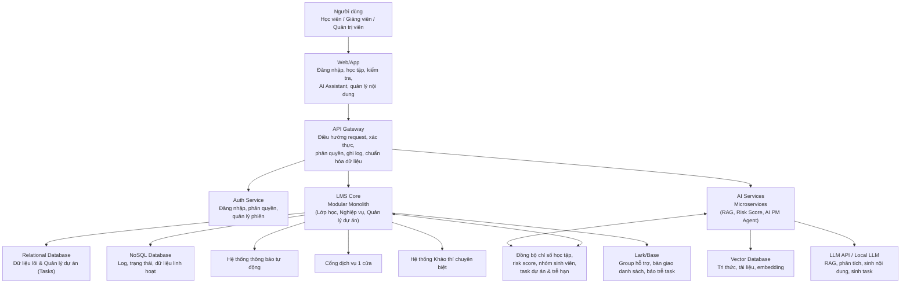
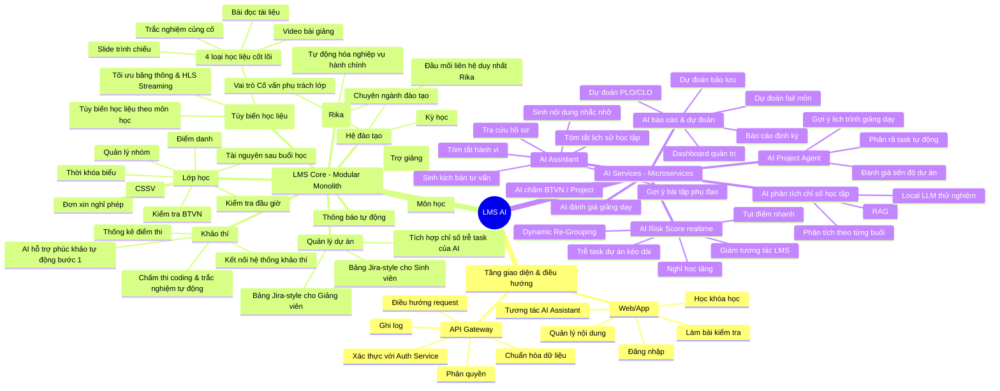
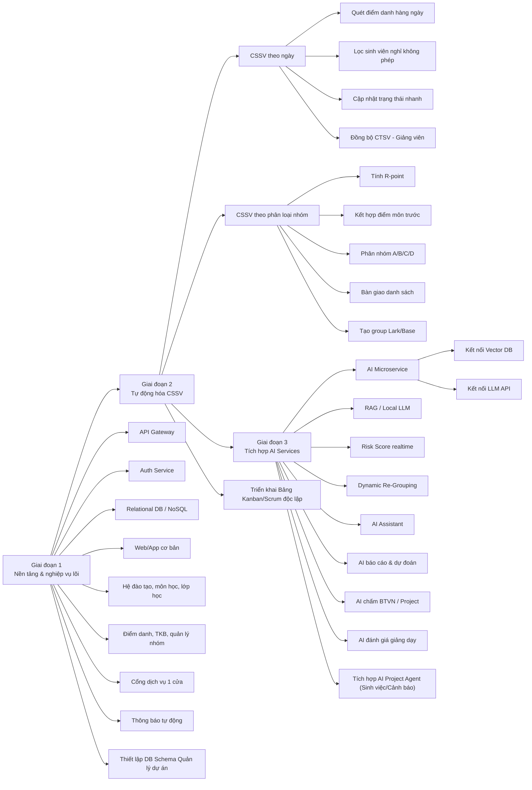
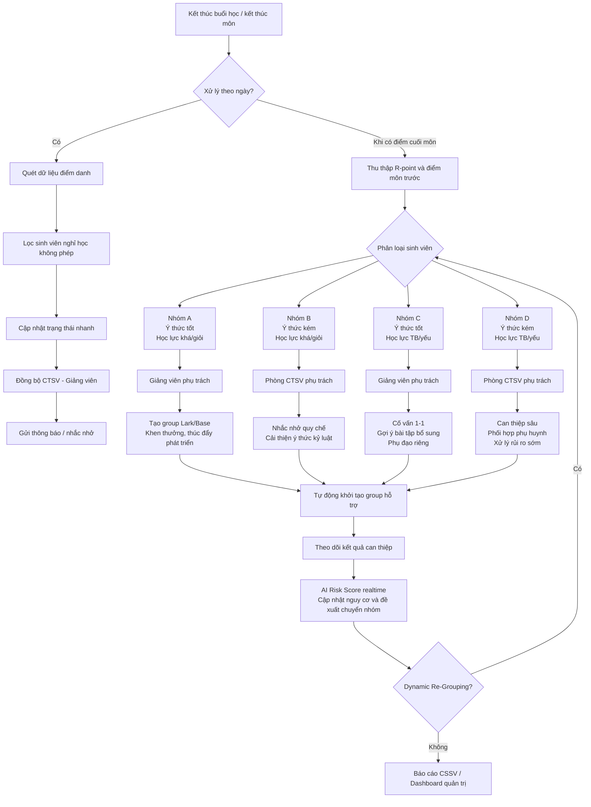
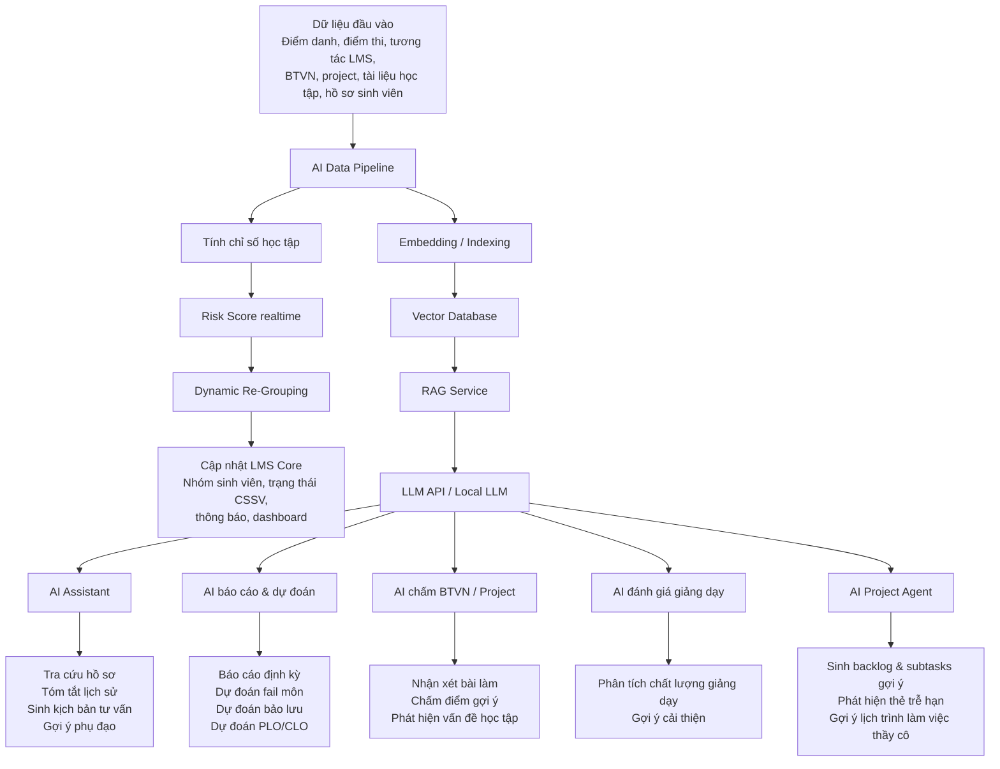
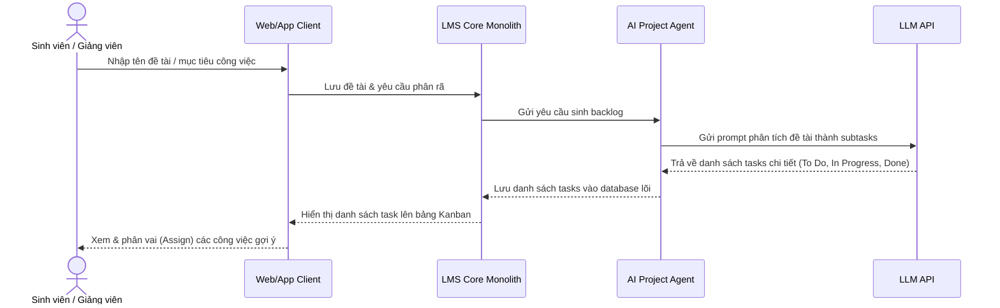
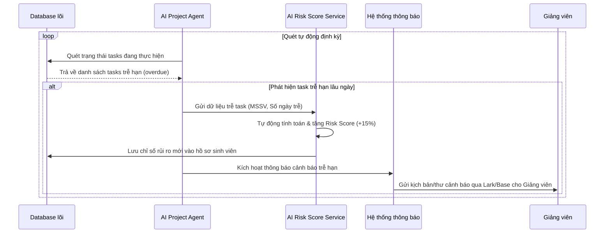

# Sơ đồ chức năng hệ thống LMS AI

## 1. Sơ đồ kiến trúc tổng thể

### 1.2 Các vấn đề tồn tại ở hệ thống cũ & Giải pháp cải tiến

Hệ thống quản lý đào tạo hiện tại đang gặp một số bất cập lớn về nghiệp vụ cốt lõi. LMS AI phiên bản mới giải quyết triệt để các vấn đề này thông qua định hướng kiến trúc như sau:

1. **Sinh viên thuộc các hệ học khác nhau học cùng một lớp vật lý:**
   - *Vấn đề:* Ràng buộc chương trình học và trọng số điểm theo Lớp (Class), dẫn đến việc sinh viên chất lượng cao, hệ chuẩn, hoặc học lại cùng lớp không thể áp dụng thang điểm khác nhau.
   - *Giải pháp:* Tách biệt thực thể **Lớp học (ClassSession)** khỏi **Chương trình học của Sinh viên (StudentCurriculum)**. Hệ thống tự động ánh xạ bộ trọng số điểm theo hệ đào tạo riêng của từng sinh viên.

2. **Lưu giữ lịch sử dữ liệu lớp học sau từng môn học:**
   - *Vấn đề:* Khi lớp chuyển sang môn học mới, dữ liệu môn cũ (bao gồm giảng viên phụ trách và các chỉ số chuyên cần, điểm số) bị ghi đè hoặc mất đi.
   - *Giải pháp:* Thiết kế bảng lịch sử `class_course_history` để lưu snapshot sau khi kết thúc môn học (Mã lớp, Mã môn, Giảng viên, Chuyên cần, Điểm trung bình môn).

3. **Sinh viên học lại và chuyển hệ học:**
   - *Vấn đề:* Khó kiểm soát lộ trình môn học bắt buộc khi sinh viên chuyển hệ hoặc đăng ký học lại do chương trình học của từng hệ bị cố định cứng.
   - *Giải pháp:* Thiết kế bảng quy đổi tương đương `course_equivalents` và quản lý lộ trình học thông qua `IndividualStudyPlan` (Chương trình học cá nhân hóa).

4. **Đồng nhất môn học khác ID giữa các khóa (Ví dụ: môn C của K24 và K25):**
   - *Vấn đề:* Môn C của K24 (ID: 101) và K25 (ID: 202) là hai dòng độc lập trong cơ sở dữ liệu. Khi sinh viên K24 học lại cùng lớp K25, hệ thống cũ không tự động tính điểm thay thế.
   - *Giải pháp:* Ánh xạ tất cả các môn học tương đương về một mã môn học gốc chung (`base_subject_id`). GPA engine sẽ gom nhóm theo mã gốc để thực hiện thay thế điểm học lại.

5. **Chưa áp dụng được các dịch vụ Trí tuệ nhân tạo (AI Services):**
   - *Vấn đề:* Quy trình giám sát học tập, phân loại rủi ro học tập của sinh viên và phân rã công việc cho dự án hoàn toàn làm thủ công, tốn nhiều thời gian của giảng viên và phòng CTSV.
   - *Giải pháp:* Tích hợp hệ thống AI Services (Microservices độc lập dùng GPU) chạy song song với LMS Core. Hệ thống tự động phân loại rủi ro học tập (Risk Score), tự động phân rã và theo dõi task của sinh viên (AI Project Agent) và cung cấp trợ lý học tập AI Assistant.

6. **Thủ tục hành chính rời rạc & Thiếu tự động hóa khảo thí (Thiếu mô hình một cửa):**
   - *Vấn đề:* Sinh viên phải liên hệ nhiều phòng ban khác nhau cho các nhu cầu hành chính, gây đùn đẩy trách nhiệm và chậm trễ. Quy trình thi cử, khảo thí và phúc khảo bài thi còn thủ công, tốn nhiều nhân lực của ban khảo thí và giảng viên.
   - *Giải pháp:* Ban hành **Cổng dịch vụ 1 cửa của RE (Rika)** trên LMS để tự động hóa/luật hóa dịch vụ. Tất cả sinh viên chỉ liên hệ làm việc với 01 nhân sự hỗ trợ duy nhất đặt tên chung là Rika (hỗ trợ bởi hệ thống tự động hóa). Đồng thời định nghĩa các vai trò mới (Giáo viên chủ nhiệm khuyến khích là Trợ giảng, Cố vấn phụ trách lớp dưới tên chung Rika) và cải tiến thi cử (thi trắc nghiệm & coding tự động, AI phúc khảo tự động bước 1, đồng bộ điểm tức thời).

## 2. Sơ đồ cây chức năng chi tiết

## 3. Sơ đồ triển khai theo giai đoạn

## 4. Sơ đồ luồng CSSV và phân loại nhóm

## 5. Sơ đồ chức năng AI Services

## 6. Luồng nghiệp vụ Quản lý Dự án (Jira Style)

### Luồng 1: AI tự động phân rã công việc (AI Task Generator)

### Luồng 2: AI theo dõi tiến độ & cảnh báo rủi ro (AI Progress Tracker)

