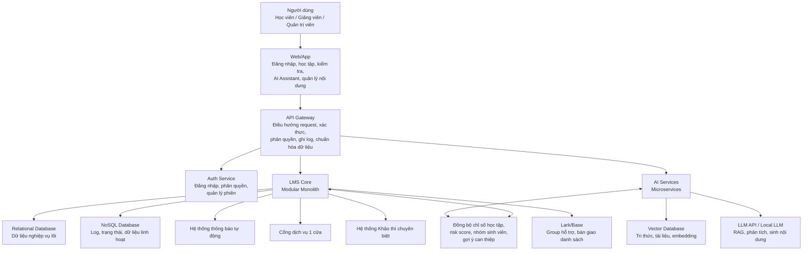
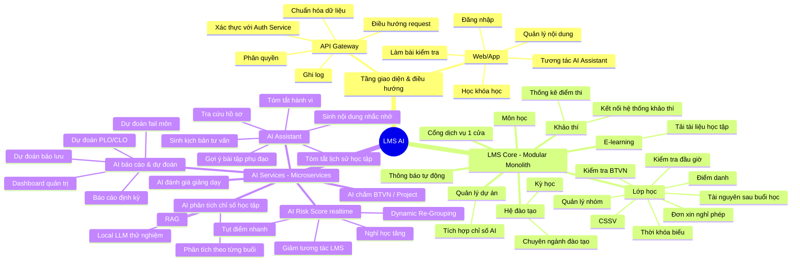
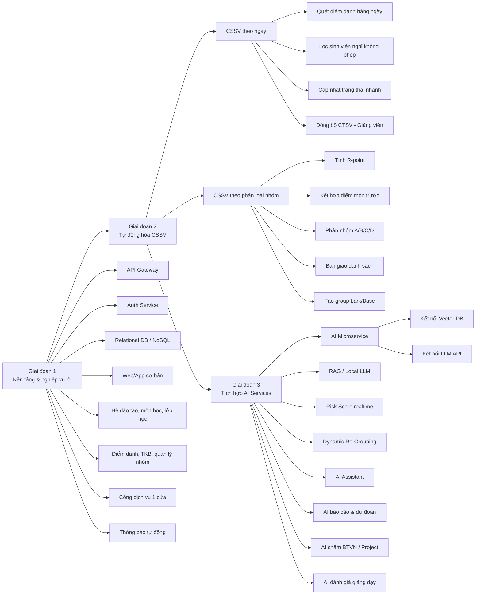
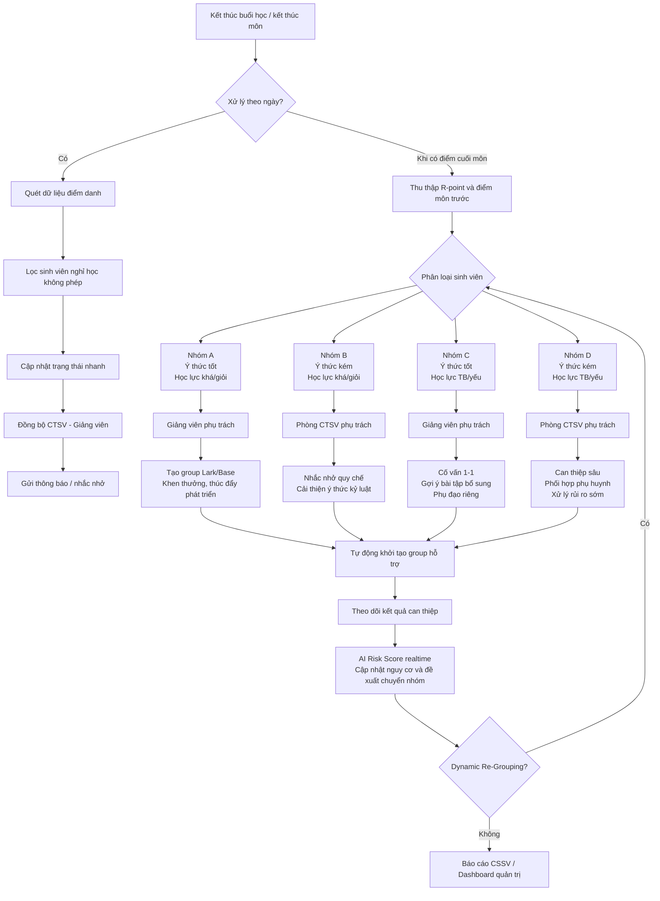
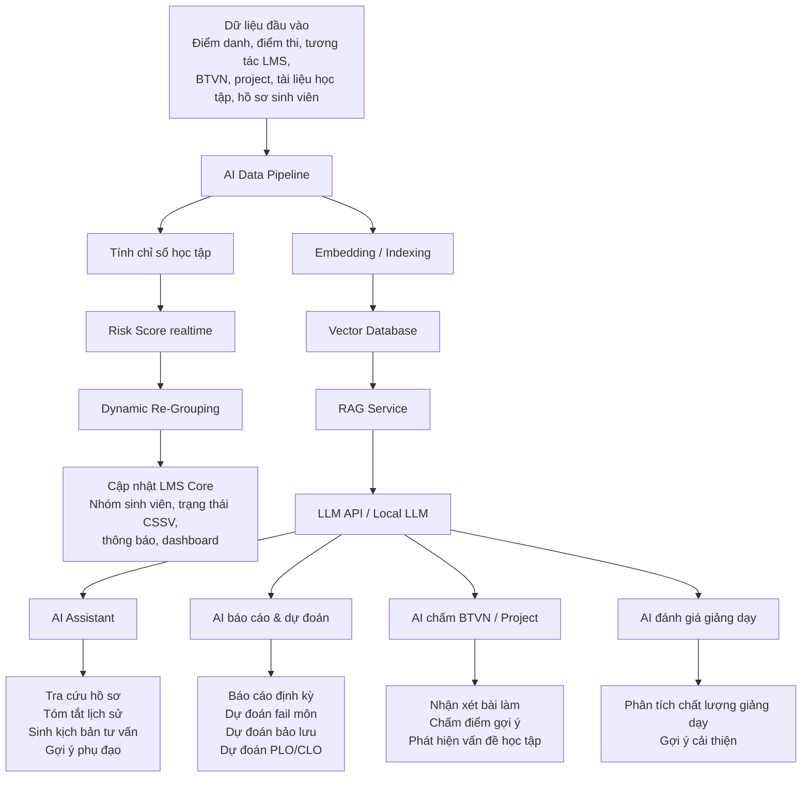

# Sơ đồ chức năng hệ thống LMS AI

## 1. Sơ đồ kiến trúc tổng thể

## 2. Sơ đồ cây chức năng chi tiết

## 3. Sơ đồ triển khai theo giai đoạn

## 4. Sơ đồ luồng CSSV và phân loại nhóm

## 5. Sơ đồ chức năng AI Services

